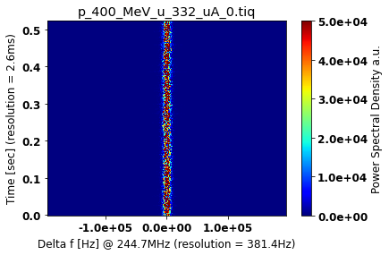
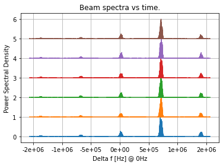
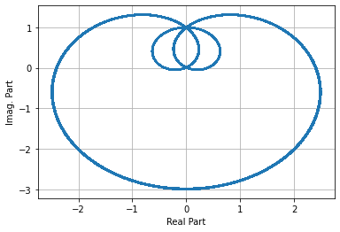
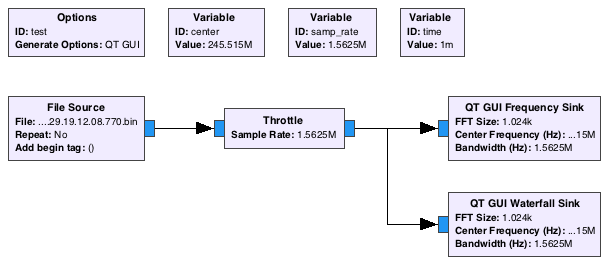
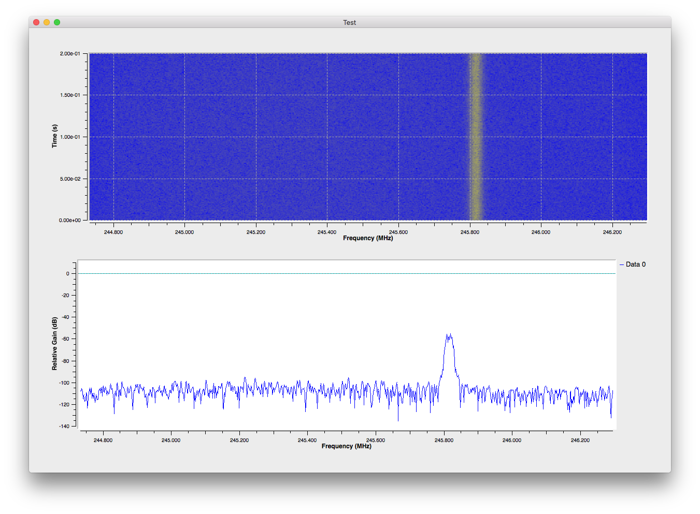

# Examples

In case you need some data file to work through these examples you can take [this one](files/p_400_MeV_u_332_uA_0.tiq).

## Example histogram using `matplotlib`

```
from iqtools import *

filename = 'p_400_MeV_u_332_uA_0.tiq'
iq = get_iq_object(filename)

iq.read_samples(200*1024)
iq.method='fft'
xx, yy, zz = iq.get_power_spectrogram(lframes=1024, nframes=200)

# change font
font = {'family' : 'normal',
        'weight' : 'bold',
        'size'   : 12}

plt.rc('font', **font)

# reduce number of ticks
plt.locator_params(axis='x', nbins=3)

plot_spectrogram(xx, yy, zz, cen=iq.center, title=iq.file_basename, decimal_place=1, zzmin=0, zzmax=50000, cmap=cm.jet)
```


The above command is for a jupyter notebook environment. If you like to make a stand alone script from it, one needs to change the last command to:

```
plot_spectrogram(xx, yy, zz, cen=iq.center, title=iq.file_basename, decimal_place=1, zzmin=0, zzmax=50000, cmap=cm.jet, filename='myfile')
```

You can also use numpy slicing of indexes in order to plot a certain region

```
sly = slice(412, 512)
slx = slice(84000,110000)
plot_spectrogram(xx[sly,slx], yy[sly,slx], zz[sly,slx], ...)
```

## Interface with CERN ROOT

```
from iqtools import *
from ROOT import TCanvas, TFile
%matplotlib inline

filename = 'p_400_MeV_u_332_uA_0.tiq'
iq = get_iq_object(filename)

iq.read_samples(200*1024)
iq.method='fft'
xx, yy, zz = iq.get_power_spectrogram(lframes=1024, nframes=200)

h3 = get_root_th2d(xx, yy, zz, name=filename, title=filename)

ff = TFile( f'{filename}.root', 'RECREATE' )
h3.Write()
h3.ProjectionX().Write()
ff.Close()

c = TCanvas(filename,filename,800,600)
c.Divide(1,2)
c.cd(1)
h3.Draw('zcol')
c.cd(2)
h3.ProjectionX().DrawClone()
c.Draw()
```


Also 1D spectra can be exported to ROOT histograms for later analysis in ROOT:

```
ff, pp, _ = iq.get_fft()
write_spectrum_to_root(ff, pp, filename, center=iq.center, title='spectrum')
```

the resulting ROOT file will contain a histogram. Also time domain data can be written to a ROOT file:

```
write_timedata_to_root(iq)
```


## Spectrum plot over time

Example of spectrum plot over time (not to be confused with a spectrogram plot)

```
from iqtools import *
filename = 'cooler_off-2022.06.24.11.12.57.427.tiq'
iq = get_iq_object(filename)
lframes = 1024
nframes=3000
for ii in range(6):
    sframes = ii * nframes
    iq.read(nframes = nframes, lframes = lframes, sframes = sframes)
    ff, pp, _ = iq.get_fft()
    plot_spectrum(ff, pp / pp.max() + ii, title='Beam spectra vs time.')
```




## Creating a synthetic signal

You can create a synthetic signal like the following:

```
fs = 22050
f = 400
center = 133
t, x = make_test_signal(400, 22050, noise=False, nharm=2)
xbar , insph = make_analytical(x)
write_signal_to_bin(xbar, 'results', fs=fs, center=center)
write_signal_to_csv(xbar, 'results', fs=fs, center=center)
plt.plot(t[:100], x[:100])
plot_hilbert(xbar)
```



The files with names `results.csv` and `results.bin` can now be read back into the code using `iqtools`.

## GNURadio interface
#### Reading GNURadio files

If you have a flow graph in gnuradio and like to save files, you can use the **file sink** block and save data. Using `iqtools` you can then import the data as usual, except that you have to provide the sampling rate. You can also use the library interface or the command line interface to convert your data into complex64 (I and Q each 32-bit) for further use in [GNU Radio](http://gnuradio.org/). Here is an example to plot an spectrogram:

    import iqtools
    filename = 'file_from_gnuradio.bin'
    iqdata = iqtools.GRData(filename, fs = 2.5e6, center=30e6)
    iqdata.read_complete_file()
    xx, yy, zz = iqdata.get_power_spectrogram(nframes=2000, lframes=1024)
    iqtools.plot_spectrogram(xx, yy, zz)

#### Writing GNURadio files

Convert data for further use in GNU Radio.

    iqtools --verbose --lframes 1024 --nframes 1 --raw p_400_MeV_u_332_uA_0.tiq

The *sampling rate* and the *center frequency* will also be printed. Or within your program like:

```
from iqtools import *
filename = 'p_400_MeV_u_332_uA_0.tiq'
iq=TIQData(filename)
iq.read_samples(1024*100)
write_signal_to_bin( iq.data_array, 'p_400_MeV_u_332_uA_0', fs=iq.fs, center = iq.center, write_header=False)
```

Later the file can be imported using a `File Source` block in GNU-Radio. Use a `Throttle` block with the sampling rate of the data.



